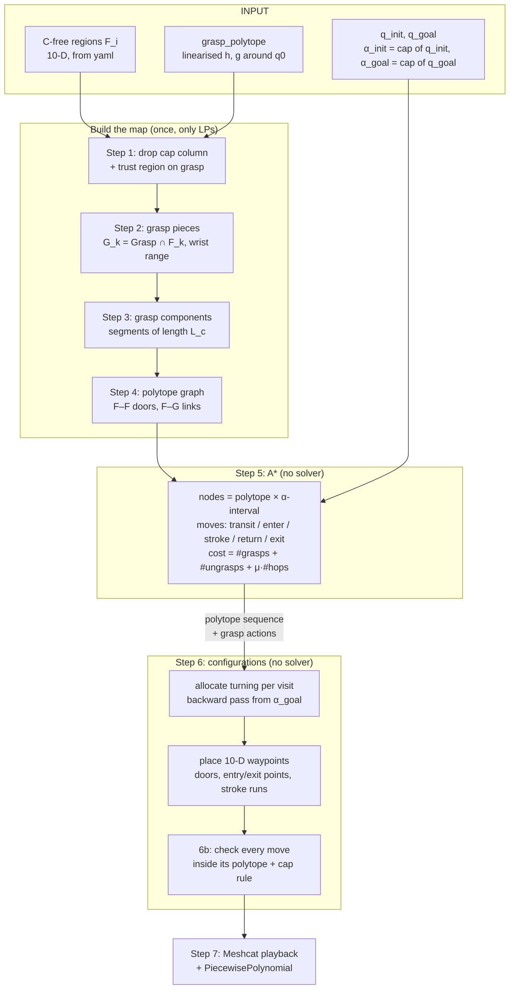
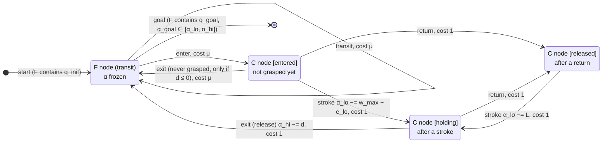

# Reachability A* for cap turning: guide

This guide explains the planner in `full_arm_planner.ipynb`, section **"Reachability A\* over free
and grasp polytopes"** (steps 0–7). It covers what each step computes, why it is designed that way,
and what is still open.

---

## 1. The problem in one picture

The robot must take the cap from angle **α_init** to **α_goal**, and end at the arm configuration of
**q_goal**. The cap turns only while the gripper is grasping it and the wrist rotates
**forward** (wrist ↑ ⇒ cap ↓, α −= Δw). Rotating the wrist **back** leaves the cap where it is. So
turning the cap works like a ratchet.

```
 cap α
  3.0 ●━━━━━━━━━━━━┓                               transit  (free space, cap frozen)
      ┃            ┃  forward stroke               grasp    (wrist ↑ turns cap)
      ┃            ┗━━━━━┓                          return   (wrist ↓, cap frozen)
  1.0 ┃                  ┗━━━━━━━━━━┓
      ┃                             ┗━━━━━┓
 -1.0 ┃                                   ┗━━━━━━━━━━● goal
      └──────────────────────────────────────────────────▶ time
        approach  │ stroke 1 │ return │ stroke 2 │ leave
```

**What we want to decide automatically, without hand design:**
- which free regions to cross;
- where to grasp;
- how many strokes to make, and in which wrist segment;
- where to leave.

The previous approaches, and what was wrong with them:

| Approach | Problem |
|---|---|
| MIQP (`_solve_for_n_grasps_CC`) | Big-M binaries (M = 1e6) cause numerical trouble. It needs an outer loop over n_grasps. |
| Brute force (cells "Brute Force trial") | The segment is picked by hand, from one grasp configuration. |
| (region, mode) graph (old A* cells) | The search did not know the cap angle, so the plan could be rejected after the search. |

---

## 2. Core idea (inspired by CASSR, Wang & Tonneau, arXiv 2603.02989)

CASSR plans footsteps with A*. Its **node is a polytope plus the part of it reachable from the
start**, not a single point. It expands a node by propagating reachability into the neighbouring
polytopes. Once the polytope sequence is chosen, a second stage places the actual positions.

We do the same thing, with state = (arm configuration x, cap angle α):

```
node  =  polytope P  ×  [α_lo, α_hi]
         └─ where the arm can be      └─ which cap angles are reachable there
```

- **The arm part is the whole polytope.** P is convex, so once you are inside it, every arm
  configuration in P can be reached by a straight line.
- **All path information lives in the α interval.** For example, reaching F_3 before grasping gives
  α ∈ {3.0}. Reaching F_3 after one stroke of length 2 gives α ∈ [1.0, 3.0]. Same polytope, different
  nodes.
- **The grasp pieces G = Grasp ∩ F are the only sets where the α interval can widen.** This is the
  research claim, written as a search rule: the grasp polytope is the switch set, or reachable set,
  between transit and transfer.

---

## 3. Pipeline



There are two stages, as in CASSR:
1. **A\*** decides the discrete part: the sequence of polytopes and the grasp actions (strokes, returns, releases).
2. **Placement** decides the continuous part: the actual configurations along that sequence.

---

## 4. The map: which sets exist and how they connect

```
          F_i ∩ F_j  ("door")                 grasp piece G_k = Grasp ∩ F_k
      ┌───────────┬───────────┐               (thin: only the wrist really moves)
      │   F_i     │    F_j    │   ┌──────────────────────────────────────┐
      │        ●──┼──●        │   │ F_k    ═══════════════════════        │
      │   transit │           │   │        w_min   G_k       w_max        │
      └───────────┴───────────┘   │          ▲ enter / exit via F_i ∩ G_k│
                                  └──────────────────────────────────────┘
```

| Set | Meaning | Where built |
|---|---|---|
| `free_sets[i]` = F_i | C-free region with the cap column removed (9-D) | Step 1 |
| `grasp9` | Grasp polytope with the cap removed and the trust region added | Step 1 |
| `pieces[k]` = G_k | `grasp9 ∩ F_k`, with its lowest- and highest-wrist points | Step 2 |
| `components[c]` | A grasp segment. Currently one piece each (`MERGE_PIECES=False`). | Step 3 |
| `ff_door[(i, j)]` | Chebyshev centre of F_i ∩ F_j (transit edge) | Step 4 |
| `fc_links[(i, c)]` | Entry and exit points of F_i ∩ G for component c (switch edge) | Step 4 |

---

## 5. Step by step

### Step 1: drop the cap, and add a trust region to the grasp polytope

**Code:** `drop_cap(poly)`, `to_arm(q)`, `to_full(x, α)`, and the `GRASP_TRUST` block.

**Dropping the cap.** The cap is ignored in the polytopes. Its column is deleted from every C-free
region and from the grasp polytope. Rows that only bounded the cap (its joint limits) become `0 ≤ b`,
so they are removed.

The cap angle α is taken from q_init and q_goal, and it only changes through the grasp pieces
(steps 5–6). If the regions didn't depend on the cap at all, deleting the column would be exact. IRIS
did produce some tilted walls that involve the cap, so deleting it shifts those walls slightly. We
accept that, by design.

**Why a trust region?** `grasp_polytope` (cell "Build grasp polytope in the nullspace…") linearises
the grasp equality `h(q) = 0` around q0 with a ±1e-3 margin. But Jh is 4×10 with **rank 4**, so the
linear constraints leave a **6-D null space unconstrained**. Without the trust region, the LP extreme
points slid about 2.3 rad in joint 2. The gripper ended up 0.8 m from the cap with |h| ≈ 0.95, yet
the points were still "inside" the grasp polytope. That is why the first Meshcat run turned the cap
without the gripper being at the cap.

The fix: the linearisation is only valid near q0, so the **6 non-wrist arm joints are kept within
±`GRASP_TRUST` (0.05 rad) of q0**, and the wrist stays free. The wrist axis passes through the EE
origin, so rotating it keeps the grasp.

| | Max arm-joint change from q0 | \|h\| | EE–cap distance |
|---|---|---|---|
| Without trust region | 2.27 rad | 0.95 | 0.80 m |
| With trust region (0.05) | 0.05 rad | 0.002 | 0.11 m (same as at q0) |

### Step 2: grasp pieces (the switch sets)

**Code:** `extreme_point(poly, direction)` solves a small LP: minimise `direction·x` over the
polytope. There are no binaries and no big-M, so it has none of the MIQP's numerical problems.

For each free region F_k, `G_k = grasp9 ∩ F_k` is kept if it is not empty. Two LPs find its lowest-
and highest-wrist points (`lo`, `hi`) and its wrist range `[w_lo, w_hi]`.

### Step 3: grasp components (wrist segments)

A **component** is a grasp segment of length `L_c`. **One forward stroke can turn the cap by at most
`L_c`.** The brute force found these segments by sweeping the wrist with the collision checker; here
they come from the polytopes.

- `L_MIN = 0.05`: segments shorter than this are ignored.
- `MERGE_PIECES = False`: each piece is its own component.
  - **Why:** every straight-line move must lie inside **one** convex set, because that is what
    certifies it as collision-free.
  - Inside a single piece this is automatic.
  - If pieces are merged, the piece you enter through may not be the piece the stroke runs in, and
    the move between them would not be covered by any single polytope.
  - The merge code (union-find plus `build_chain`) is kept for later.

### Step 4: the polytope graph

- **Transit edges.** F_i and F_j are adjacent if their intersection is not empty. The door is the
  Chebyshev centre of the intersection.
- **Switch edges.** F_i and component c are adjacent if F_i ∩ G is not empty. For each such
  intersection we store:
  - `entry`: its **highest**-wrist point, the best place to enter;
  - `exit`: its **lowest**-wrist point, the best place to leave.

  **Why these two points?** Moving the wrist forward while grasping always turns the cap. So leaving
  "ahead" of where you entered forces some turning. Entering high and exiting low keeps that forced
  turning as small as possible.

The graph is built in full here. CASSR builds it lazily; that is a possible later optimisation.

### Step 5: the A* search



**Node (`ReachNode`):** `kind` ("F" or "C"), `set_id`, `alpha_lo`, `alpha_hi`, `g`, `h`, `parent`,
`action`. C nodes also store the entry wrist range (`entry_w_lo`, `entry_w`) and a **phase**:
- `entered`: just arrived, nothing grasped yet. The wrist can be anywhere in the entry range.
- `holding`: just finished a forward stroke, still grasping.
- `released`: after a return (ungrasped, wrist rotated back), ready for a full stroke.

**Cost = grasp actions + ungrasp actions**, plus a small price μ = `HOP_COST` (1e-3) per polytope
change. Approach motions have no contact, so they only break ties.

| Move | Physical | α interval rule | Cost |
|---|---|---|---|
| transit F_i → F_j | approach | unchanged | μ |
| enter F_i → C | approach | unchanged | μ |
| stroke from `entered` | grasp | `α_lo −= w_max − e_lo`; the stroke starts inside the entry range | 1 |
| stroke from `released` | grasp | `α_lo −= L` | 1 |
| return | ungrasp | unchanged | 1 |
| exit from `holding` | ungrasp (release) | `α_hi −= d`, with `d = max(0, lowest exit wrist − highest entry wrist)` | 1 |
| exit from `entered` (only if d ≤ 0) | never grasped | unchanged | μ |

α_lo is always clipped at α_goal and at the cap's lower joint limit.

- **Why a stroke gives an interval, not one value:** one stroke can turn by any amount up to its cap.
  Partial turns are therefore included automatically.
- **Why exit lowers α_hi:** reaching an exit ahead of the entry means moving the wrist forward, and
  that turns the cap by at least d.
- **Why exit costs 1:** otherwise "exit and re-enter elsewhere" would be a free substitute for a
  return.
- **Why the return before the first stroke disappears:** entering G_k from F_i requires
  F_i ∩ G_k ≠ ∅, so F_i touches F_k, and F_k ∩ G_k = G_k covers the piece's whole wrist range. So
  there is always a one-hop route (cost μ) to start the first stroke at w_min, and with μ < 1 the
  search takes it. If μ > 1, it falls back to a return (tested on a toy map).

**Heuristic:** `h = 2·⌈(α_lo − α_goal)/L_max⌉`, plus 1 if `holding`.
- **Admissible:** every remaining stroke must be followed by an ungrasp (a return or the final
  release), and a holding node still has to release.
- **Consistent:** no move lowers h by more than its cost.
- ⇒ **A\* returns the fewest grasp + ungrasp actions**, with ties broken by fewer hops.

**Pruning (`dominated`):** skip a node if a node with the same key was already expanded, with an
interval that contains this one, at no higher cost. The key is (kind, set) for F nodes, and (kind,
set, entry range, phase) for C nodes. This is exact, because the reachable set really is
polytope × interval.

**"Longest segment" and "fewest grasps" come out without hand-tuning.** A segment of length L needs
⌈D/L⌉ strokes, where D = α_init − α_goal, so A* picks the segment that minimises the action count.
It will also split turning across segments, or regrasp somewhere else, when that saves actions.

**Output:** `count_actions(path)` gives the numbers of grasps, returns, releases and hops.

### Step 6: configurations on the chosen sequence (no solver)

This follows the visit's action list exactly, for example `stroke, return, stroke, exit`.

**1. Allocate the turning (backward pass).** Each stroke has a cap: `w_max − e_lo` straight after
entering, `L` after a return. Start from `α_after = α_goal` at the last visit and walk the visits
backwards:

```
T_visit = min(α_hi before the visit, α_after + Σ caps) − α_after
α_after ← α_after + T_visit
```

It must end exactly at α_init; the code asserts this. `split_turn` then divides T_visit among the
visit's strokes, as evenly as the caps allow (water-filling).

**2. Place the points** (`build_waypoints`, using the "ends high" rule so the exit is always
reachable). α goes in the cap slot, so every waypoint is a full 10-D configuration.

```
 wrist
 w_max ┤        ●━━━━━━━━━━━━━━━━●  exit (release)
       │       ╱│               ╱
       │ stroke │ return       ╱ stroke
       │     ╱  │           ╱
 w_min ┤ enter●  ●━━━━━━━━━●
       └──────────────────────────▶
```

- **transit:** go through the door `ff_door[(i, j)]`.
- **enter:**
  - if the visit starts with a stroke: go to the point of F_i ∩ G at wrist `w_max − t1`, clipped to
    the entry range (`point_in_link`);
  - otherwise: go to the highest-wrist entry point.
- **stroke:** wrist ↑ by t, cap −= t.
- **return:** wrist ↓ to `min(current, w_max − t_next)`, cap still.
- **exit (release):** go to the point of G ∩ F_j at wrist `min(current, highest exit wrist)`. The
  wrist moves back or not at all, so the cap does not turn.
- **goal:** finally q_goal, with cap = α_goal.

Grasp points lie on the segment between G's lowest- and highest-wrist points (`point_at_wrist`), or
between the extreme points of F_i ∩ G. So they stay inside G by convexity. Each waypoint stores the
polytope that **certifies the straight line leading into it**.

**Step 6b** checks every move:
- both endpoints are inside the certifying polytope, so the whole line is inside it;
- the cap rule holds: inside a grasp piece, wrist ↑ ⇒ Δcap = −Δwrist; everywhere else, Δcap = 0.

**Would a QP help?** A QP on the fixed sequence (MIQP constraints 3/4, with no binaries) could
shorten the path: better door points and no zig-zags. It cannot change the discrete structure (which
polytopes, how many strokes and returns), because A* decides that. It is optional future work.

### Step 7: playback

`play_waypoints` interpolates each move linearly and publishes it to Meshcat, as the brute force
does. The cap value is interpolated too, which is exactly the α −= Δwrist rule on forward runs.
`astar_traj` is a `PiecewisePolynomial` for the slice viewer.

---

## 6. Current result: brute-force scenario, cap 3.0 → −1.0 (D = 4)

| Quantity | Value |
|---|---|
| Grasp pieces (trust region 0.05) | 8, of which 4 span the full wrist range [−1, 1] (L = 2) |
| Search | 0.003 s, 63 nodes expanded |
| Plan | enter C3 (G_6) from F6 → stroke, return, stroke → release into F0 |
| Cost | 2 grasps + 2 ungrasps (1 return, 1 release) + 1 hop = 4.001 |
| All moves valid (6b) | yes |
| Grasp residual along the plan | \|h\| ≈ 0.002, EE–cap ≈ 0.11 m (same as q0) |

These numbers come from rebuilding the notebook state headless, with **q0 as start and goal**,
because the brute-force centroid cells were not re-run. Your run uses the brute-force centroids,
so its numbers will differ.

---

## 7. Guarantees and limits

| | Status |
|---|---|
| Complete (finds a plan if the map has one) | Yes: the state space is finite (α_lo is clipped at α_goal and drops by L ≥ L_MIN) |
| Optimal number of grasp + ungrasp actions | Yes: the heuristic is admissible and consistent, and pruning is exact |
| Optimal path length | **No.** Placement is fixed after the search, which is CASSR's stated limitation too. An optional QP on the fixed sequence (MIQP constraints 3/4, with no binaries) could fix this later. |
| Collision-free | Only as far as the polytopes are correct. There is no collision checker, by design. |

---

## 8. Open items and knobs

1. **Polytope false positives.** Every region allows the full wrist range [−1, 1], while the
   collision checker found only [−1, −0.19] and [0.70, 0.92]. Once the regions are fixed, the pieces
   shrink and the plan uses more, shorter strokes, with no code changes.
2. **`GRASP_TRUST` = 0.05.** A larger value gives bigger pieces but a less valid linearisation.
   Check |h| along the plan. A more principled grasp set would be the wrist-axis box from #80.
3. **`MERGE_PIECES = False`.** Merging needs chain-aware placement, so that every move stays inside
   one piece.
4. **Hop price `HOP_COST` (μ).** At 1e-3, the search takes any detour to save one grasp or ungrasp
   action. Raise it (e.g. 0.2 means one action is worth 5 hops) if detours become too long.
5. **Duplicate cells:** cells 36–38 are an old copy of step 0/1. The main sequence starts at the
   second "## Reachability A\*" heading.

---

## 9. Variable cheat sheet

| Name | Step | What it is |
|---|---|---|
| `W` | 1 | wrist index in 9-D (cap removed) |
| `free_sets`, `grasp9` | 1 | cap-free C-free regions; grasp polytope with trust region |
| `pieces[k]` | 2 | `{poly, lo, hi, w_lo, w_hi}` for G_k = grasp9 ∩ F_k |
| `components[c]` | 3 | `{pieces, chain, w_min, w_max, L}`; `L_MAX` = the largest L |
| `ff_door`, `free_neighbors` | 4 | transit doors and adjacency |
| `fc_links`, `comps_near`, `free_near_comp` | 4, 5a | switch links (entry/exit points) |
| `HOP_COST`, `ReachNode`, `successors`, `reachability_astar`, `count_actions` | 5 | the search |
| `astar_path`, `astar_info` | 5c | the node sequence and search statistics |
| `split_turn`, `build_waypoints` → `astar_waypoints`, `astar_visits` | 6 | 10-D waypoints and turning per visit |
| `play_waypoints`, `astar_traj` | 7 | Meshcat playback and the trajectory |
