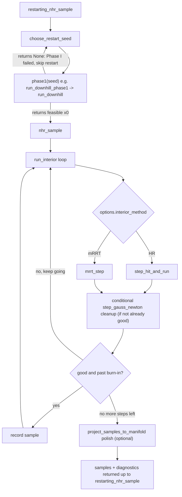

# `nhr.py` Code Walkthrough

A section-by-section guide to `algorithms/nhr.py`, in the same order as the file, meant to be read side-by-side with the source. For *how to run it*, see the separate user guide; this doc is about *what each piece does and why it's shaped that way*.

`nhr.py` is a from-scratch Python port of the reference C++ sampler behind Toussaint/Braun/Ortiz-Haro's "NLP Sampling" paper (`rai`'s `src/Optim/NLP_Sampler.cpp`), not the paper's own simplified pseudocode — the two differ in one important way (see "Key design decisions" below). It implements a **restarting two-phase sampler**: Phase I finds one feasible point per restart (Gauss-Newton downhill), Phase II explores the feasible set from there using one of two interchangeable interior methods (NHR or mRRT).

## Mental model: how a call flows through the file

Everything in the file exists to support one of these boxes.

## Key design decisions worth knowing before reading the code

- **Ported from the reference's actual behavior, not the paper's own pseudocode.** The paper's simplified "Algorithm 3" requires strict `g(y)<=0` to accept a hit-and-run step. The real C++ code is more lenient: accept if things "don't get worse" (§ `step_hit_and_run`), paired with a separate conditional Gauss-Newton cleanup applied once per outer iteration (§ `run_interior`). This project intentionally follows the real code.
- **Two interior methods, selected by `NHROptions.interior_method`:** `"HR"` (Nonlinear Hit-and-Run, a local random walk with a coupled line-search step) and `"mRRT"` (Manifold-RRT, a tree-based method that jumps to the nearest visited point and takes one fixed-size step). mRRT was added because HR's line search couples *all* coordinates' step size to whichever inequality is currently tightest — a single razor-thin constraint can throttle mixing on coordinates that have nothing to do with it. mRRT never consults inequalities while building a step, sidestepping that coupling entirely.
- **Equality constraints** are handled by tangent-space direction projection (shared by both methods) plus a loose epsilon-margin "tube" used only during the walk — deliberately looser than the tolerance used to judge a final sample.
- **`constraint_tol` defaults to `good_err_tol`**, not a tiny fixed epsilon. The sampler only ever certifies a recorded point's *combined* slack sum is below `good_err_tol`; gating the final filter at something far tighter (e.g. a fixed `1e-8`) would reject almost every sample nothing was ever asked to satisfy that tightly.
- **The final polish (`project_samples_to_manifold`) fixes both `g` and `h`**, not just `h` — it reuses the same Gauss-Newton cleanup mechanism `run_interior` uses internally, run to a fixed iteration budget.

---

## Top of file (lines 1–40)

- Module docstring states the "reference vs. paper" divergence up front — the single most important thing to know before reading anything else.
- `Array = np.ndarray`: a type alias used everywhere for signature readability.
- `_json_safe(value)`: recursively converts numpy arrays/scalars and `Path`s into plain JSON-safe Python types. Used only by `save_joint_sample_artifacts` when writing `info.json`.

## Options (lines 47–125)

**`NHROptions`** (line 48) — the master config object threaded through nearly every function. Fields group into:
- *Sampling volume*: `num_samples`, `burn_in`, `thinning`.
- *HR's step geometry*: `delta_max` (line-search half-width; `None` defaults to `slack_max_step`), `walk_margin` (loose equality-tube width during the walk), `eps_slack_increase` (how much total slack may worsen and still be accepted), `hit_and_run_inner_tries` (retries per step before giving up).
- *Gauss-Newton cleanup tuning* (shared by Phase I, `run_interior`'s cleanup, and the final polish): `penalty_mu`, `slack_step_alpha`, `slack_max_step`, `slack_reg_lambda`.
- *Feasibility gates*: `good_err_tol` (internal "good enough to record" threshold) vs. `constraint_tol` (final per-row filter tolerance — `None` defaults to `good_err_tol`).
- *Interior method*: `interior_method: "HR"|"mRRT"`, `interior_noise_sigma` (mRRT's fixed step length; unused by HR).
- *Misc*: `finite_difference_step`, `random_seed`, `verbose`.
- `__post_init__` resolves the two `None`-able fields.

**`RestartOptions`** (line 120) — much smaller: `num_restarts`, `strategy` (`"uniform"|"distance"|"direction"`), `candidates_per_restart`, `random_seed`, `keep_failed_phase1_seeds` (currently informational only — not wired to any behavior change).

## Pure math primitives (lines 132–247)

- `finite_difference_jacobian(fun, x, step)` — central-difference numeric Jacobian; the automatic fallback whenever an analytic Jacobian isn't supplied (see `_default_jacobian`).
- `clip_interval_with_linear_ineq(beta_lo, beta_up, g_bar, a, tol)` — the core 1-D interval-clipping primitive: given a scalar step `beta` along a direction, shrinks `[beta_lo, beta_up]` so every row of `g_bar + beta*a <= 0` holds. Every "how far can I step before hitting a constraint" computation in the file is built from this.
- `clip_interval_with_box_bounds(...)` — applies the above twice (once per bound direction) to get the box-constrained interval.
- `project_direction_to_equality_tangent(d, Jh_x, regularization)` — `d_tan = d - J_h^T(J_h J_h^T + reg I)^-1 J_h d`. Used by both HR's direction sampling and mRRT's step. Algebraically equivalent to the reference's `pinv`-based formula but cheaper (inverts an `m x m` Gram matrix, `m` = number of equality rows, instead of `n x n`).

## Evaluation model (lines 254–383)

- **`Eval`** (line 255) — a full snapshot at one point `x`: `g`/`Jg` (raw inequality features + Jacobian), `h`/`Jh` (raw equality features + Jacobian), `s`/`Js` (the combined **slack** vector — `ReLU(g)` stacked with sign-corrected `|h|` — and its Jacobian), `gpos` (just `ReLU(g)`, ports the reference's field), `err` (`sum(s)`, the single scalar "how infeasible is this point" number almost everything else is built on).
- `evaluate_point(x, g, Jg, h, Jh)` — pure function building an `Eval` from scratch; the single source of truth for what "infeasibility" means here. Equality rows get sign-flipped in `s`/`Js` so one Gauss-Newton formula can treat inequality slack and equality residual uniformly.
- `apply_equality_margin(ev, margin)` — turns `h(x)=0` into a pair of loose inequalities `|h(x)| <= margin`, non-mutating. Used transiently inside `step_hit_and_run` so the walk can explore a tube around the manifold instead of being confined to a measure-zero surface.
- `sample_random_tangent_direction(x, Jh, rng, regularization)` — draws `N(0,I)`, tangent-projects if `h` is given, normalizes. HR's proposal-direction generator (mRRT computes its direction differently — see `mrrt_step`).
- `gauss_newton_slack_delta(s, Js, n, penalty_mu, lam)` / `apply_trust_region(delta, alpha, max_step)` — the two pure-math halves of a damped Gauss-Newton step (raw descent direction, then trust-region scaling). Split out so both `step_gauss_newton` and any future caller can reuse just the math.

## Walker state and stepping (lines 389–760)

This is the largest and most important section — the actual stepping mechanics for both Phase I and Phase II.

- **`ProblemFns`** (line 390) — bundles `g, Jg, lower, upper, h, Jh, f, extra_check` so they aren't threaded as 8 separate args through every function below.
- **`WalkerState`** (line 404) — the mutable "where am I / what did I last see" state: `x` (current point), `ev` (its `Eval`), `ev_stored` (a snapshot for revert/comparison), `evals` (counter, incremented only on real recomputation). `.initialize(x0, problem)` builds the first `Eval`.
- `ensure_eval(state, problem)` — the memoization gate: if `state.ev.x` already matches `state.x` (within `1e-10`), returns the cached `Eval`; otherwise recomputes and increments `evals`. Since every `g`/`h` call in this project ultimately triggers a Drake forward-kinematics solve, **this cache is load-bearing**, not an afterthought — worth remembering when instrumenting eval counts.
- `store_eval(state, problem)` — snapshots the current evaluation into `ev_stored`, right before a step that might need reverting.
- `bound_clip(state, problem)` — plain `np.clip(x, lower, upper)`. **Does not call `ensure_eval` afterward** — see the `run_downhill` quirk below.
- `step_gauss_newton(...)` — one damped GN step toward zero slack: `ensure_eval` → `gauss_newton_slack_delta` + `apply_trust_region` → update `x` → re-evaluate. Always "succeeds" (no internal accept/reject); three different callers (`run_downhill`, `run_interior`'s cleanup, `nhr_sample`'s final polish) each separately decide what to do with the result.
- **`step_hit_and_run(state, problem, options, rng)`** (line 474) — **the core HR step**:
  1. Snapshot state; compute `g_aug` (inequalities plus equality-as-tube) and baselines `g0`/`s0`.
  2. Sample one tangent-projected direction.
  3. Clip a `beta` interval, first by box bounds, then in a loop by the current point's linearized inequalities.
  4. Each trial moves `x` by a sampled `beta` **from wherever the last trial left it** — a *chained* walk, not independent retries from a fixed anchor. Only reverts entirely if every try is exhausted.
  5. Accepts as soon as the worst inequality is no worse than at the start *and* total slack hasn't grown by more than `eps_slack_increase` — a lenient "doesn't get worse" test, not strict `g<=0`.
  Returns a dict with `reason` in `{accepted, mh_accept, mh_reject, empty_interval, exhausted_tries}`.
- `run_downhill(state, problem, options)` (line 552) — Phase I's workhorse: repeated `step_gauss_newton` + `bound_clip`, with a Wolfe-style schedule (`alpha` halves and reverts on a slack increase, else grows ×1.2 up to 1). Returns `True`/`False`.
  **Quirk:** no `ensure_eval` after `bound_clip`, so the Wolfe check can transiently compare against a pre-clip evaluation — self-heals next iteration, but means the point returned on success can occasionally be a *clipped* version of the point that was actually evaluated as good. (Empirically observed downstream as a rare `nhr_failed` restart — not a bug, a faithful port of the reference's own behavior.)
- **`ManifoldTree`** (line 585) — mRRT's memory: parallel lists of every visited point (`points`) and each one's own cached tangent-projection matrix (`projectors`, computed once in `.append()`, not recomputed on lookup). `.nearest(x_target)` is brute-force squared-distance nearest-neighbor (fine at this project's sample counts).
- **`mrrt_step(state, problem, options, rng, tree)`** (line 621) — mRRT's step: sample a uniformly random target anywhere in the box, find the nearest visited anchor + its tangent projector, project `(target - anchor)` onto that tangent space, jump `anchor + direction*(interior_noise_sigma/‖direction‖)`. No line search, **no inequality consultation at all** while building this step.
- **`run_interior(state, problem, options, rng)`** (line 652) — **the sampling loop both methods share**. Per iteration: evaluate current point; check "good" (`err<=good_err_tol`, plus optional `extra_check`); if using mRRT, append current point+projector to the tree *before* deciding whether to record (so a point can anchor its own future steps); record as a sample if good and past burn-in; take one step (`step_hit_and_run` or `mrrt_step`); if the result isn't already good, run one conditional `step_gauss_newton` cleanup pass.
  **Deliberate off-by-one:** records/checks at every `t` including before any step is taken, but only loops `burn_in+num_samples-1` times — ported exactly from the reference, not "fixed."
- `_default_jacobian(fn, value_fn, step)` — if `fn` is `None` and `value_fn` is given, returns a finite-difference-Jacobian closure over `value_fn`; otherwise passes `fn` through. Lets callers omit `Jg`/`Jh` and get numeric differentiation automatically.
- `run_downhill_phase1(seed, g, lower, upper, options, Jg, h, Jh)` (line 736) — the native, Drake-IK-free Phase I entry point: wraps `run_downhill` behind a `phase1(seed) -> Optional[x0]` signature, exactly what `restarting_nhr_sample` expects to call. Returns `None` on failure.

## Public sampling entry points (lines 767–937)

- `is_feasible(x, g, constraint_tol, h, equality_tol, extra_check)` (line 767) — the final acceptance test: `g(x)<=constraint_tol` row-wise, `|h(x)|<=equality_tol` row-wise if `h` given, plus an optional extra boolean check.
- **`nhr_sample(x0, g, lower, upper, Jg, f, extra_check, options, h, Jh, equality_tol, project_samples_to_manifold, projection_iters)`** (line 794) — **the single-chain entry point**:
  1. Validates `x0` is already near-feasible (raises `ValueError` otherwise — Phase I must run first).
  2. Builds `ProblemFns` + `WalkerState`, calls `run_interior`.
  3. Optionally thins the result.
  4. If `project_samples_to_manifold`: for each recorded sample, runs `slack_reduce_equalities` (if `h` given) then a fixed-budget joint `g`+`h` `step_gauss_newton` polish, then drops anything that still fails `is_feasible`.
  The polish loop deliberately **never early-exits on `options.constraint_tol`** — since that now defaults to `good_err_tol`, which every recorded sample already satisfies on entry, an early-exit there would make the polish a no-op right when it's needed most.
- `nhr_sample_with_equalities(...)` (line 917) — thin backward-compatible wrapper around the same path with `h`/`Jh` set.

## Restart seeding (lines 944–1202)

- `sample_uniform_box(lower, upper, rng)` — one uniform sample in the box.
- `gauss_newton_slack_step(x, g, Jg, h, Jh, ...)` — a standalone (stateless) GN slack-reduction step used only by `choose_restart_seed`'s `"direction"` strategy — similar math to `step_gauss_newton` but a separate code path (no `WalkerState` needed).
- `choose_restart_seed(lower, upper, rng, D, strategy, candidates_per_restart, slack_step)` (line 1003) — the paper's 3 restart-seeding strategies (§3.3): `"uniform"` (plain random), `"distance"` (sample many candidates, keep the one farthest from all previously-accepted samples `D`), `"direction"` (keep the candidate whose GN slack step points least toward existing samples). `D` accumulates across restarts within one call.
- **`restarting_nhr_sample(phase1, g, lower, upper, Jg, f, extra_check, nhr_options, restart_options, slack_step, h, Jh, equality_tol, project_samples_to_manifold, projection_iters)`** (line 1071) — **the top-level entry point most callers should use.** For each restart: choose a seed, call `phase1(seed)` (skip restart if `None`), call `nhr_sample` on the resulting `x0` (skip restart if it raises — e.g. the rare `run_downhill` clip quirk). Collects every restart's samples plus a per-restart info dict (`status` in `{success, phase1_failed, nhr_failed}`) — this `all_info` list is what `per_restart_spread` and `save_joint_sample_artifacts` both consume.
- `restarting_nhr_sample_with_equalities(...)` (line 1149) — thin wrapper, same shape.
- **`per_restart_spread(samples, restart_info, idx)`** (line 1175) — **the mixing diagnostic.** For each successful restart, computes that chain's own mean/std/range for coordinate `idx`. Compare the median of these stds ("within-chain std") to the std of the means themselves ("across-restart std"): if within-chain is tiny while across-restart is large, that coordinate's *pooled* histogram only looks fine because restarts land in different places, not because any chain actually explores locally. This is the exact test that caught HR's mixing collapse on the wrist/cap joints and confirmed mRRT fixes it.

## Manifold projection / superseded helpers (lines 1209–1365)

- `slack_reduce_equalities(x, h, Jh, lower, upper, ..., max_iters, tol)` (line 1209) — iterative GN projection onto `h(x)=0` only; the first half of `nhr_sample`'s polish step.
- `make_tangent_direction_projector`, `make_active_set_direction_projector`, `make_gauss_newton_corrector` (lines 1258–1365) — **all three are marked SUPERSEDED in their own docstrings.** They were bolted onto an earlier, stricter-accept version of the sampler to survive tight constraints, and are **no longer called by `nhr_sample`/`restarting_nhr_sample`** (which don't even accept a `direction_projector`/`corrector` argument anymore). `step_hit_and_run`'s built-in tangent projection + lenient accept, and mRRT's decoupled stepping, solve the same problem structurally instead. Kept only for ad hoc experimentation — don't expect to see them on the main call path.

## Plotting and saving artifacts (lines 1372–1557)

- `save_joint_sample_artifacts(samples, diagnostics, lower, upper, joint_names, options, output_root, note, timestamp, bins, show)` (line 1372) — the only function in the file touching matplotlib/scipy. Saves one histogram PNG per joint (mean/std/Gaussian-fit overlay, limit lines) plus a single `info.json` with per-joint stats, the options used, and everything passed via `diagnostics`/`restart_info` (through `_json_safe`). This is what `nhr_standalone_test.py` calls at the end of a run.

---

## Quirks cheat-sheet

A consolidated list of the intentional, faithfully-ported non-obvious behaviors scattered through the file as inline comments:

| Where | Quirk |
|---|---|
| `run_downhill` | No `ensure_eval` after `bound_clip` — the Wolfe check can transiently use a stale (pre-clip) evaluation; self-heals next iteration, but can rarely make the returned "successful" `x0` marginally infeasible after clipping. |
| `step_hit_and_run` | Inner tries are a *chained* walk (each trial starts where the last one left off), not independent retries from a fixed point — only fully reverts if every try is exhausted. |
| `run_interior` | Deliberate off-by-one: checks/records at every `t` including before any step, but only loops `burn_in+num_samples-1` times. |
| `NHROptions.constraint_tol` | Defaults to `good_err_tol`, not a small fixed epsilon — don't tighten it without considering that the polish loop no longer early-exits on it either (by design, see `nhr_sample`). |
| `mrrt_step` | Never consults `g` while building a step — all inequality correction happens afterward, in `run_interior`'s shared cleanup and (optionally) `nhr_sample`'s final polish. |
| `ManifoldTree.append` | Computes and caches each point's tangent projector once at insertion time, not recomputed at lookup — matters if `Jh` is expensive. |
